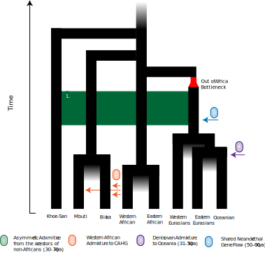
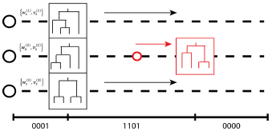
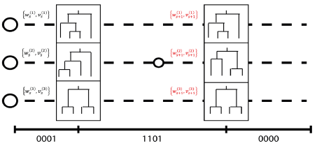
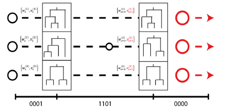
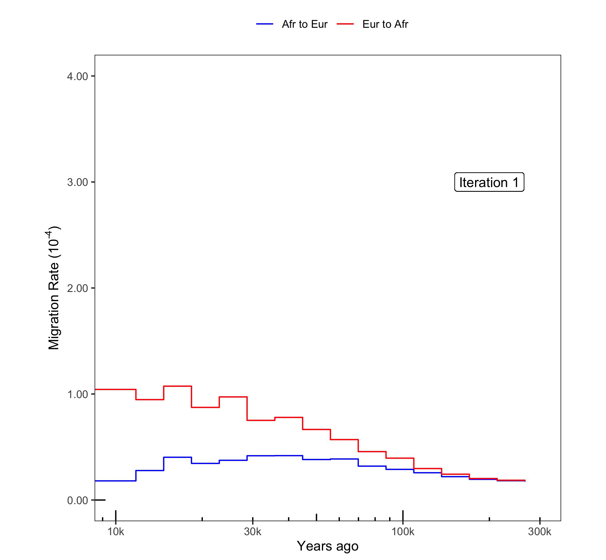
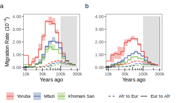
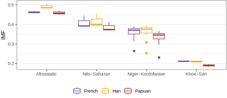
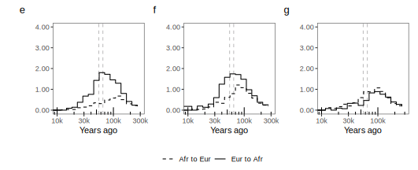
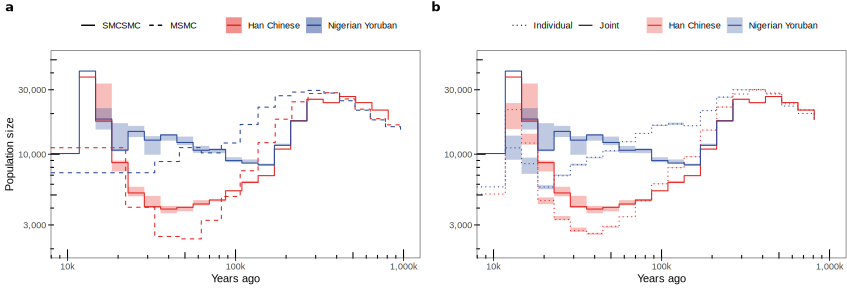
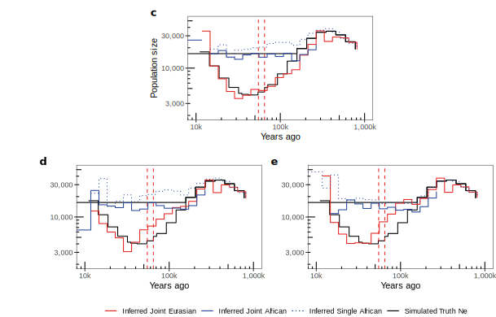

## Disclaimers / Notes

> - This is a preprint
> - I am not a historian / anthropologist / archaeologist 
> - Slides are available at https://github.com/Chris1221/eghop_270720


## Overview

- Summary (~ 1 minute)
- Algorithm in brief (~ 5 minutes)
- Results (~ 5 minutes)
- Discussion (~ 5 minutes)

# Summary

## Summary

```{r, echo=FALSE, out.width = '60%', fig.align="center"}

```


# Algorithm (in brief)

## `smcsmc`

- Sequential Monte Carlo for the Sequentially Markovian Coalescent
- Infer demographic parameters (effective population size, directional migration) over a number of piecewise constant epochs
    - Similar to MSMC(2) in this regard, but we control the epochs.
- Python package
    - Install with `conda`
    - https://github.com/luntergroup/smcsmc

## Algorithm

> - Simulate ancestral recombination graphs sequentially across the genome with parameters $\theta$ 
>     - [Sequential coalescent with recombination model](https://github.com/scrm/scrm) (`scrm`)) 
> - Using information about variation, asign a weight $w_i$ to each of the particles (histories). 
> - As you move along the genome, resample if the collection of particles becomes too similar (effective sample size gets too low).
> - Use variational Bayes to update the parameter estimtes $\theta$ until convergence


## Step 1: Simulate and extend ARGs

```{r, echo=FALSE, out.width = '100%'}
knitr::include_graphics("~/repos/eghop_250720/img/algo1.svg", error = TRUE)
```

## Step 2: Simulate recombination events

```{r, echo=FALSE, out.width = '100%'}

```

## Step 3: Update weights 

```{r, echo=FALSE, out.width = '100%'}

```

## Step 4: Resample if low ESS

```{r, echo=FALSE, out.width = '100%'}

```

ESS = Effective sample size (of the particle population)

## Algorithm in action

```{r, echo=FALSE, out.width = '60%', fig.align="center"}

```

## Study design

- Pairs of individual WGS samples from Simons Genome Diversity Panel (SGDP) and Human Genome Diversity Project (HGDP) 
    - HGDP samples experimentally phased, SGDP statistically phased.
- Simulations done in SCRM with known demographic parameters
- $D$ statistics (a la Patterson 2012) in `admixr` (highly recommend)
    - Ancient samples include Vindija and Altai Neanderthals
    - Many more from the [Reich Human Origins](https://reich.hms.harvard.edu/downloadable-genotypes-present-day-and-ancient-dna-data-compiled-published-papers) dataset 
- All experiments were replicated three times.
    
## Substantial Directional Migration

```{r, echo=FALSE, out.width = '100%', fig.align="center"}

```

## Integrated Migration by Population
    
```{r, echo=FALSE, out.width = '100%', fig.align="center"}

```

IMF = Integrated migration fraction, or the total proportion replaced over a given time period.
 

## Simulations Confirm Power
    
```{r, echo=FALSE, out.width = '100%', fig.align="center"}

```

In order, simulated Eurasia to Africa migration, bidirectional, and Africa to Eurasia migration. Many more scenarios in the supplemental material.
    
## Migration inflated $N_e$ estimation

```{r, echo=FALSE, out.width = '100%', fig.align="center"}

```

MSMC2 run with default parameters. 

## Migration inflates $N_e$ in simulation

```{r, echo=FALSE, out.width = '80%', fig.align="center"}

```

## No excess Neanderthal introgression

```{r, echo=FALSE, out.width = '90%', fig.align="center"}
knitr::include_graphics("img/dstats.svg")
```

## Key references {.small}

1. Cole, C. B., Zhu, S. J., Mathieson, I., Prüfer, K., & Lunter, G. (2020). Ancient Admixture into Africa from the ancestors of non-Africans. BioRxiv. https://doi.org/10.1101/2020.06.01.127555
2. Henderson, D., Zhu, S. (Joe), Cole, C. B., & Lunter, G. (2018). Demographic inference using particle filters for continuous Markov jump processes. BioRxiv, 382218. https://doi.org/10.1101/382218
3. Staab, P. R., Zhu, S., Metzler, D., & Lunter, G. (2015). scrm: efficiently simulating long sequences using the approximated coalescent with recombination. Bioinformatics, 31(10), 1680–1682. https://doi.org/10.1093/bioinformatics/btu861
